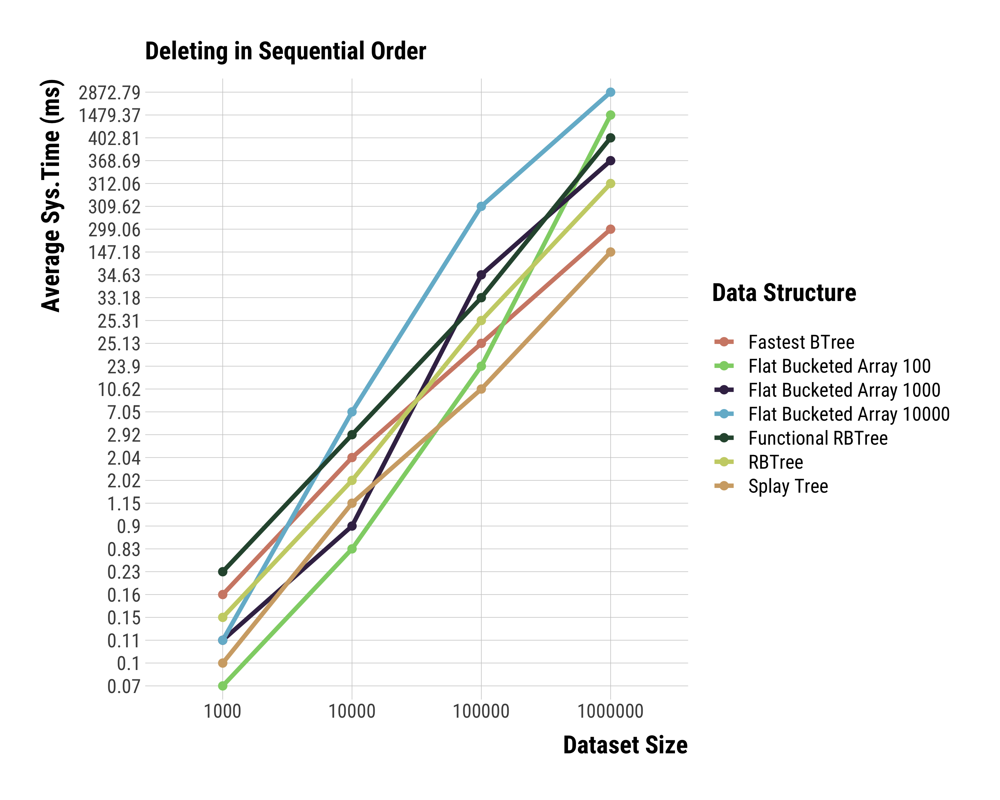

# N6idus 
[](https://github.com/brurucy/n6idus/actions/workflows/node.js.yml)
[](https://codecov.io/gh/brurucy/n6idus)

### TOC

  1. Intro
  2. Why should you use N6idus?
  3. The API
     * push(item)
     * has(item)
     * select(ith)
     * delete(item)
     * deleteByindex(ith)
     * filter(callbackFn, cmp, bucketSize)
     * map(callbackFn, cmp, bucketSize)
     * reduce(callbackFn, acc)
     * reduceRight(callbackFn, acc)
     * forEach(callbackFn)
     * makeForwardCursor()
     * makeBackwardsCursor()
     * makeForwardCursorByIndex(ith, ith)
     * makeBackwardsCursorByIndex(ith, ith)
     * makeForwardCursorByValue(item, item)
     * makeBackwardsCursorByValue(item, item)
     * union(otherIndexedOrderedSet)
     * intersection(otherIndexedOrderedSet)
     * difference(otherIndexedOrderedSet)
     * symmetricDifference(otherIndexedOrderedSet)
     * sameAs(otherIndexedOrderedSet)
     * isSuperset(otherIndexedOrderedSet)
     * isProperSuperset(otherIndexedOrderedSet)
     * isSubset(otherIndexedOrderedSet)
     * isProperSubset(otherIndexedOrderedSet)
     * isDisjointWith(otherIndexedOrderedSet)
     * isEmpty(otherIndexedOrderedSet)
     * getMin()
     * getMax()
     * pop()
     * shift()
     * sliceByValue(item, item)
     * spliceByValue(item, item)
     * sliceByIndex(ith, ith)
     * spliceByIndex(ith, ith)
     * toArray()
     * filterToArray(callbackFn)
     * mapToArray(callbackFn)
     * every(callbackFn)
     * some(callbackFn)
     * nextHigherKey(item)
     * nextLowerKey(item)
  4. Benchmarks
     * Adding in sequential order
     * Searching in sequential order
     * Getting the i-th element in sequential order
     * Deleting in sequential order
     * Adding in random order
     * Searching in random order
     * Getting the i-th element in random order
     * Deleting in random order

### Intro

N6idus is an opinionated collection of experimental data structures optimized for performance.

At the moment we provide a single data structure, the **Flat Bucketed Array**, which is used to implement a **Indexed Ordered Set**.

Here are the use cases in which people usually yearn for **Indexed Ordered Sets**

1. Virtually any purpose that you would use a search tree for AND
2. You need to fetch the i-th element in logarithmic time AND
3. You want to use set operations

Sometime in the future, we will also have(in this order):

   1. Indexed Ordered Map, planned to be released on 0.1.0
   2. Persistent Indexed Ordered Set, 0.2.0

### Why should you use N6idus?

Our **Indexed Ordered Set** is fast. Really, **Really** fast.

In fact, just go to the benchmarks session and see. It's around twice as fast as the currently fastest search tree.

The perplexingly simple data structure behind it, the **Flat Bucketed Array**, is nothing but an array of arrays of fixed size
with a clever [Fenwick Array](https://en.wikipedia.org/wiki/Fenwick_tree) as an index, that uses a **special** algorithm 
to bisect it in **O(log(n))** instead of **O(log^2(n))**time.

It is quite similar to [sortedcontainers](https://github.com/grantjenks/python-sortedcontainers), with the main difference
being in the indexing and balancing strategy.

**Also, we have 100% test coverage.**

Here are the worst-case complexities, with **B** being the **load factor/bucket size**:

| operation   |     worst-case complexity  |
|-------------|--------------------------- |
| push(n)     |         O(B)               |
| has(n)      |  O(log(n/B) * log(B))      |
| select(ith) |   O(log(n/B))              |
| delete(n)   |   O(B)                     |


### The API

Here's how the **Flat Bucketed Array** looks like, underneath:

1. The main object is the **Indexed Ordered Set**, which is comprised of **SortedArraySet**s with fixed **load factor/bucket size** lengths.
2. A **SortedArraySet** is just a length-limited array with a **max** attribute and with all operations ensuring sortedness.
3. You can (and should) provide a **cmp** function. However, **WARNING**, the cmp function should be a **partial order**, that is, you have to be able to say that some **x** is **less than or equal to** some y. Here is the default cmp function: ```(x, y) => { return x <= y }```

Please, report any and **all** bugs you might come across.

#### Basic Operations:

##### Push
```javascript
import { IndexedOrderedSet } from "n6idus";
const ios = new IndexedOrderedSet();
ios.push(1);
console.log(ios);
// IndexedOrderedSet {
// buckets: [
//     SortedArraySet {
//         bucket: [Array],
//         max: 1,
//         cmp: [Function (anonymous)]
//     }
// ],
//     index: FenwickArray { innerStructure: [ 1 ] },
// length: 1,
//     cmp: [Function (anonymous)],
//     bucketSize: 1000
// }
```
##### Has
```javascript
import {IndexedOrderedSet} from "n6idus";
const ios = new IndexedOrderedSet()
ios.push(1);
console.log(ios.has(1));
// true
```
##### Select

Gets the i-th element.

```javascript
import {IndexedOrderedSet} from "n6idus";
const ios = new IndexedOrderedSet()
ios.push(1);
ios.push(2);
console.log(ios.select(0));
//1
```
##### Delete
```javascript
import {IndexedOrderedSet} from "n6idus";
const ios = new IndexedOrderedSet()
ios.push(1);
ios.push(2);
ios.delete(1);
console.log(ios);
// IndexedOrderedSet {
// buckets: [
//     SortedArraySet {
//         bucket: [Array],
//         max: 2,
//         cmp: [Function (anonymous)]
//     }
// ],
//     index: FenwickArray { innerStructure: [ 1 ] },
// length: 1,
//     cmp: [Function (anonymous)],
//     bucketSize: 1000
// }
```

##### Delete by Index
```javascript
import {IndexedOrderedSet} from "n6idus";
const ios = new IndexedOrderedSet()
ios.push(1);
ios.push(2);
ios.deleteByIndex(0);
console.log(ios);
// IndexedOrderedSet {
// buckets: [
//     SortedArraySet {
//         bucket: [Array],
//         max: 2,
//         cmp: [Function (anonymous)]
//     }
// ],
//     index: FenwickArray { innerStructure: [ 1 ] },
// length: 1,
//     cmp: [Function (anonymous)],
//     bucketSize: 1000
// }
```

#### ES6:

##### Filter

Filters over position and value

```javascript
import {IndexedOrderedSet} from "n6idus";
const ios = new IndexedOrderedSet()
ios.push(1);
ios.push(2);
ios.push(3);
ios.push(4);
ios.push(5);
const ios2 = ios.filter(([position, value]) => value % 2 === 0)
console.log(ios2.buckets)
// [
//  SortedArraySet {
//  bucket: [ 2, 4 ],
//      max: 4,
//      cmp: [Function (anonymous)]
//  }
// ]
```

##### Map

Maps over position and value

```javascript
import {IndexedOrderedSet} from "n6idus";
const ios = new IndexedOrderedSet()
ios.push(1);
ios.push(2);
ios.push(3);
ios.push(4);
ios.push(5);
const ios2 = ios.map(([position, value]) => value * 6);
console.log(ios2.buckets);
// [
//  SortedArraySet {
//  bucket: [ 6, 12, 18, 24, 30 ],
//       max: 30,
//       cmp: [Function (anonymous)]
// }
// ]
```

##### Reduce

Reduces over position and value

```javascript
import {IndexedOrderedSet} from "n6idus";
const ios = new IndexedOrderedSet();
ios.push(1);
ios.push(2);
ios.push(3);
ios.push(4);
ios.push(5);
const reducer = (acc, [position, value]) => {
    return acc + value.toString();
};
const product = ios.reduce(reducer, '');
console.log(product);
// 12345
```

##### ReduceRight

Reduces over position and value, starting from the end

```javascript
import {IndexedOrderedSet} from "n6idus";
const ios = new IndexedOrderedSet();
ios.push(1);
ios.push(2);
ios.push(3);
ios.push(4);
ios.push(5);
const reducer = (acc, [position, value]) => {
    return acc + value.toString();
};
const product = ios.reduceRight(reducer, '');
console.log(product);
// 54321
```

##### ForEach

Calls a function over each element of the set, does not return anything.

```javascript
import {IndexedOrderedSet} from "n6idus";
const ios = new IndexedOrderedSet();
ios.push(1);
ios.push(2);
ios.push(3);
ios.push(4);
ios.push(5);
ios.forEach(([position, value]) => {
    console.log(position, value);
});
// 0 1
// 1 2
// 2 3
// 3 4
// 4 5
```

#### Iterators:

##### MakeForwardCursor
```javascript
import {IndexedOrderedSet} from "n6idus";
const ios = new IndexedOrderedSet();
ios.push(1);
ios.push(2);
ios.push(3);
ios.push(4);
ios.push(5);
for (const [position, value] of ios.makeForwardCursor()) {
    console.log(position, value);
}
// 0 1
// 1 2
// 2 3
// 3 4
// 4 5
```

##### MakeBackwardsCursor
```javascript
import {IndexedOrderedSet} from "n6idus";
const ios = new IndexedOrderedSet();
ios.push(1);
ios.push(2);
ios.push(3);
ios.push(4);
ios.push(5);
for (const [position, value] of ios.makeBackwardsCursor()) {
    console.log(position, value);
}
// 4 5
// 3 4
// 2 3
// 1 2
// 0 1
```

##### MakeForwardCursorByIndex
```javascript
import {IndexedOrderedSet} from "n6idus";
const ios = new IndexedOrderedSet();
ios.push(1);
ios.push(2);
ios.push(3);
ios.push(4);
ios.push(5);
for (const [position, value] of ios.makeForwardCursorByIndex(1, 3)) {
    console.log(position, value);
}
// 1 2
// 2 3
// 3 4
```

##### MakeBackwardsCursorByIndex
```javascript
import {IndexedOrderedSet} from "n6idus";
const ios = new IndexedOrderedSet();
ios.push(1);
ios.push(2);
ios.push(3);
ios.push(4);
ios.push(5);
for (const [position, value] of ios.makeBackwardsCursorByIndex(3, 1)) {
    console.log(position, value);
}
// 3 4
// 2 3
// 1 2
```

##### MakeForwardCursorByValue
```javascript
import {IndexedOrderedSet} from "n6idus";
const ios = new IndexedOrderedSet();
ios.push(10);
ios.push(20);
ios.push(30);
ios.push(40);
ios.push(50);
for (const [position, value] of ios.makeForwardCursorByValue(20, 40)) {
    console.log(position, value);
}
// 1 20
// 2 30
// 3 40
```

##### MakeBackwardsCursorByValue
```javascript
import {IndexedOrderedSet} from "n6idus";
const ios = new IndexedOrderedSet();
ios.push(10);
ios.push(20);
ios.push(30);
ios.push(40);
ios.push(50);
for (const [position, value] of ios.makeBackwardsCursorByValue(40, 20)) {
    console.log(position, value);
}
// 3 40
// 2 30
// 1 20
```

#### Set Operations:

##### Union
```javascript
import { IndexedOrderedSet } from 'n6idus';
const ios = new IndexedOrderedSet();
ios.push(1);
ios.push(2);
ios.push(3);
ios.push(4);
ios.push(5);
const ios2 = new IndexedOrderedSet();
ios2.push(3);
ios2.push(4);
ios2.push(5);
ios2.push(6);
ios2.push(7);
const ios3 = ios.union(ios2);
console.log(ios3.buckets);
// [
//     SortedArraySet {
//     bucket: [
//         1, 2, 3, 4,
//         5, 6, 7
//     ],
//     max: 7,
//     cmp: [Function (anonymous)]
// }
// ]
```

##### Intersection
```javascript
import { IndexedOrderedSet } from 'n6idus';
const ios = new IndexedOrderedSet();
ios.push(1);
ios.push(2);
ios.push(3);
ios.push(4);
ios.push(5);
const ios2 = new IndexedOrderedSet();
ios2.push(3);
ios2.push(4);
ios2.push(5);
ios2.push(6);
ios2.push(7);
const ios3 = ios.union(ios2);
console.log(ios3.buckets);
// [
//     SortedArraySet {
//     bucket: [ 3, 4, 5 ],
//     max: 5,
//     cmp: [Function (anonymous)]
// }
// ]
```

##### Difference
```javascript
import { IndexedOrderedSet } from 'n6idus';
const ios = new IndexedOrderedSet();
ios.push(1);
ios.push(2);
ios.push(3);
ios.push(4);
ios.push(5);
const ios2 = new IndexedOrderedSet();
ios2.push(3);
ios2.push(4);
ios2.push(5);
ios2.push(6);
ios2.push(7);
const ios3 = ios.difference(ios2);
console.log(ios3.buckets);
// [
//     SortedArraySet {
//     bucket: [ 1, 2 ],
//     max: 2,
//     cmp: [Function (anonymous)]
// }
// ]
```

##### Symmetric Difference
```javascript
import { IndexedOrderedSet } from 'n6idus';
const ios = new IndexedOrderedSet();
ios.push(1);
ios.push(2);
ios.push(3);
ios.push(4);
ios.push(5);
const ios2 = new IndexedOrderedSet();
ios2.push(3);
ios2.push(4);
ios2.push(5);
ios2.push(6);
ios2.push(7);
const ios3 = ios.difference(ios2);
console.log(ios3.buckets);
// [
//     SortedArraySet {
//     bucket: [ 1, 2, 6, 7 ],
//     max: 7,
//     cmp: [Function (anonymous)]
// }
// ]
```

##### Same as

Two sets are equal **if** they contain exactly the same elements.

```javascript
import { IndexedOrderedSet } from 'n6idus';
const ios = new IndexedOrderedSet();
ios.push(1);
ios.push(2);
ios.push(3);
ios.push(4);
ios.push(5);
const ios2 = new IndexedOrderedSet();
ios2.push(1);
ios2.push(2);
ios2.push(3);
ios2.push(4);
ios2.push(5);
console.log(ios.sameAs(ios2));
```

##### Is Superset
```javascript
import { IndexedOrderedSet } from 'n6idus';
const ios = new IndexedOrderedSet();
ios.push(1);
ios.push(2);
ios.push(3);
ios.push(4);
ios.push(5);
const ios2 = new IndexedOrderedSet();
ios2.push(1);
ios2.push(2);
ios2.push(3);
ios2.push(4);
ios2.push(5);
console.log(ios.isSupersetOf(ios2));
ios.push(6);
console.log(ios.isSupersetOf(ios2));
ios.delete(1);
console.log(ios.isSupersetOf(ios2));
// true
// true
// false
```

##### Is Proper Superset
```javascript
import { IndexedOrderedSet } from 'n6idus';
const ios = new IndexedOrderedSet();
ios.push(1);
ios.push(2);
ios.push(3);
ios.push(4);
ios.push(5);
const ios2 = new IndexedOrderedSet();
ios2.push(1);
ios2.push(2);
ios2.push(3);
ios2.push(4);
ios2.push(5);
console.log(ios.isProperSupersetOf(ios2));
ios.push(6);
console.log(ios.isProperSupersetOf(ios2));
ios.delete(1);
console.log(ios.isProperSupersetOf(ios2));
// false
// true
// false
```

##### Is Subset
```javascript
import { IndexedOrderedSet } from 'n6idus';
const ios = new IndexedOrderedSet();
ios.push(1);
ios.push(2);
ios.push(3);
ios.push(4);
ios.push(5);
const ios2 = new IndexedOrderedSet();
ios2.push(1);
ios2.push(2);
ios2.push(3);
ios2.push(4);
ios2.push(5);
console.log(ios.isSubsetOf(ios2));
ios.push(6);
console.log(ios.isSubsetOf(ios2));
ios.delete(1);
ios.delete(6);
console.log(ios.isSubsetOf(ios2));
// true
// false
// true
```

##### Is Proper Subset
```javascript
import { IndexedOrderedSet } from 'n6idus';
const ios = new IndexedOrderedSet();
ios.push(1);
ios.push(2);
ios.push(3);
ios.push(4);
ios.push(5);
const ios2 = new IndexedOrderedSet();
ios2.push(1);
ios2.push(2);
ios2.push(3);
ios2.push(4);
ios2.push(5);
console.log(ios.isProperSubsetOf(ios2));
ios.push(6);
console.log(ios.isProperSubsetOf(ios2));
ios.delete(1);
ios.delete(6);
console.log(ios.isProperSubsetOf(ios2));
// false
// false
// true
```

##### Is Disjoint With
```javascript
import { IndexedOrderedSet } from 'n6idus';
const ios = new IndexedOrderedSet();
ios.push(1);
ios.push(2);
ios.push(3);
ios.push(4);
ios.push(5);
const ios2 = new IndexedOrderedSet();
ios2.push(6);
ios2.push(7);
console.log(ios.isDisjointWith(ios2));
ios.push(6);
console.log(ios.isDisjointWith(ios2));
// true
// false
```

##### Is Empty
```javascript
import { IndexedOrderedSet } from 'n6idus';
const ios = new IndexedOrderedSet();
console.log(ios.isEmpty());
ios.push(1);
ios.push(2);
console.log(ios.isEmpty());
ios.delete(1);
ios.delete(2);
console.log(ios.isEmpty());
// true
// false
// true
```

#### Heap operations: 

##### getMin
```javascript
import { IndexedOrderedSet } from 'n6idus';
const ios = new IndexedOrderedSet();
ios.push(1);
ios.push(2);
ios.push(3);
ios.push(4);
console.log(ios.getMin());
ios.deleteByIndex(0);
console.log(ios.getMin());
// 1
// 2
```

##### getMax
```javascript
import { IndexedOrderedSet } from 'n6idus';
const ios = new IndexedOrderedSet();
ios.push(1);
ios.push(2);
ios.push(3);
ios.push(4);
console.log(ios.getMax());
ios.deleteByIndex(ios.length - 1);
console.log(ios.getMax());
// 4
// 3
```

##### pop
```javascript
import { IndexedOrderedSet } from 'n6idus';
const ios = new IndexedOrderedSet();
ios.push(1);
ios.push(2);
ios.push(3);
ios.push(4);
console.log(ios.getMax());
ios.pop();
console.log(ios.getMax());
// 4
// 3
```

##### shift
```javascript
import { IndexedOrderedSet } from 'n6idus';
const ios = new IndexedOrderedSet();
ios.push(1);
ios.push(2);
ios.push(3);
ios.push(4);
console.log(ios.getMin());
ios.shift();
console.log(ios.getMin());
// 1
// 2
```

#### Range Operations:

##### Slice by Value
```javascript
import { IndexedOrderedSet } from 'n6idus';
const ios = new IndexedOrderedSet();
ios.push(1);
ios.push(2);
ios.push(3);
ios.push(4);
ios.push(5);
ios.push(6);
ios.push(7);
ios.push(8);
ios.push(9);
ios.push(10);
const ios2 = ios.sliceByValue(3, 7);
console.log(ios2.buckets);
console.log(ios.buckets);
// [
//     SortedArraySet {
//     bucket: [ 3, 4, 5, 6, 7 ],
//     max: 7,
//     cmp: [Function (anonymous)]
//     }
// ]
//     [
//     SortedArraySet {
//     bucket: [
//         1, 2, 3, 4,  5,
//         6, 7, 8, 9, 10
//     ],
//         max: 10,
//         cmp: [Function (anonymous)]
//     }
// ]
```

##### Splice by Value
```javascript
import { IndexedOrderedSet } from 'n6idus';
const ios = new IndexedOrderedSet();
ios.push(1);
ios.push(2);
ios.push(3);
ios.push(4);
ios.push(5);
ios.push(6);
ios.push(7);
ios.push(8);
ios.push(9);
ios.push(10);
ios.spliceByValue(2, 6);
console.log(ios.buckets);
// [
//     SortedArraySet {
//     bucket: [ 1, 7, 8, 9, 10 ],
//     max: 10,
//     cmp: [Function (anonymous)]
//     }
// ]
```

##### Slice by Index
```javascript
import { IndexedOrderedSet } from 'n6idus';
const ios = new IndexedOrderedSet();
ios.push(1);
ios.push(2);
ios.push(3);
ios.push(4);
ios.push(5);
ios.push(6);
ios.push(7);
ios.push(8);
ios.push(9);
ios.push(10);
const ios2 = ios.sliceByIndex(2, 6);
console.log(ios2.buckets);
console.log(ios.buckets);
// [
//     SortedArraySet {
//     bucket: [ 3, 4, 5, 6, 7 ],
//         max: 7,
//         cmp: [Function (anonymous)]
//     }
// ]
// [
//     SortedArraySet {
//     bucket: [
//         1, 2, 3, 4,  5,
//         6, 7, 8, 9, 10
//     ],
//     max: 10,
//     cmp: [Function (anonymous)]
//     }
// ]
```

##### Splice by Index
```javascript
import { IndexedOrderedSet } from 'n6idus';
const ios = new IndexedOrderedSet();
ios.push(1);
ios.push(2);
ios.push(3);
ios.push(4);
ios.push(5);
ios.push(6);
ios.push(7);
ios.push(8);
ios.push(9);
ios.push(10);
ios.spliceByIndex(1, 5);
console.log(ios.buckets);
//
// [
//     SortedArraySet {
//     bucket: [ 1, 7, 8, 9, 10 ],
//         max: 10,
//         cmp: [Function (anonymous)]
//     }
// ]
```

#### To Array Conversions

##### To Array
```javascript
import {IndexedOrderedSet} from "n6idus";
const ios = new IndexedOrderedSet();
ios.push(10);
ios.push(2);
ios.push(8);
ios.push(3);
ios.push(12);
console.log(ios.toArray());
// [ 2, 3, 8, 10, 12 ]
```

##### Filter to Array
```javascript
import {IndexedOrderedSet} from "n6idus";
const ios = new IndexedOrderedSet()
ios.push(1);
ios.push(2);
ios.push(3);
ios.push(4);
ios.push(5);
const ios2 = ios.filterToArray(([position, value]) => value % 2 === 0);
console.log(ios2);
// [ 2, 4 ]
```

##### Map to Array
```javascript
import {IndexedOrderedSet} from "n6idus";
const ios = new IndexedOrderedSet()
ios.push(1);
ios.push(2);
ios.push(3);
ios.push(4);
ios.push(5);
const ios2 = ios.mapToArray(([position, value]) => value * 6);
console.log(ios2);
// [ 6, 12, 18, 24, 30 ]
```

#### Misc. Logical

##### Every
```javascript
import { IndexedOrderedSet } from 'n6idus';
const ios = new IndexedOrderedSet();
ios.push(1);
ios.push(2);
ios.push(3);
ios.push(4);
ios.push(5);
console.log(ios.every(([position, value]) => value % 2 === 0));
// false
```

##### Some
```javascript
import { IndexedOrderedSet } from 'n6idus';
const ios = new IndexedOrderedSet();
ios.push(1);
ios.push(2);
ios.push(3);
ios.push(4);
ios.push(5);
console.log(ios.some(([position, value]) => value % 2 === 0));
// true
```

#### Misc. Basic

##### Next Higher Key
```javascript
import { IndexedOrderedSet } from 'n6idus';
const ios = new IndexedOrderedSet();
ios.push(1);
ios.push(2);
ios.push(3);
ios.push(4);
ios.push(5);
console.log(ios.nextHigherKey(3));
console.log(ios.nextHigherKey(5));
// 4
// null
```

##### Next Lower Key
```javascript
import { IndexedOrderedSet } from 'n6idus';
const ios = new IndexedOrderedSet();
ios.push(1);
ios.push(2);
ios.push(3);
ios.push(4);
ios.push(5);
console.log(ios.nextLowerKey(3));
console.log(ios.nextLowerKey(1));
// 2
// null
```

### Benchmarks

#### Indexed Ordered Set

We've benchmarked the **Flat Bucketed Array**, with differing **Load Factor** values against the **most popular** collections for sorted sets:

1. [Splay Tree from CollectionsJS](https://www.collectionsjs.com/sorted-set)
2. [The (supposedly)Fastest BTree](https://www.npmjs.com/package/sorted-btree)
3. [Non-persistent Red-Black Tree](https://www.npmjs.com/package/bintrees)
4. [Persistent Red-Black Tree](https://www.npmjs.com/package/functional-red-black-tree)

The test machine was an M1 MBA, and there were more than ten thousand runs averaged out for the following plots.

Adding, searching and deleting were tested, with different insertion approaches: sequentially, that is
monotonically and unrealistically, and at random(realistically).

The **Flat Bucketed Array** is, at least, around **twice** as fast as all others in every single benchmark but the sequential
deletion one, due to how balancing is done, however, the **spliceByValue** and **spliceByIndex** functions offset that.

It's not likely that you would ever have to actually change a load factor different than the default, however, if you do
I hope that these benchmarks will serve as a reference for tuning that parameter.

##### Adding in Sequential Order


##### Searching in Sequential Order


##### Getting the i-th element in Sequential Order


##### Deleting in Sequential Order



##### Adding in Random Order


##### Searching in Random Order


##### Getting the i-th element in Random Order


##### Deleting in Random Order


### License

Please **cite** this github repo as a source if you use this in a research paper.

Copyright 2021 B. Rucy. C. A. De Lima

Redistribution and use in source and binary forms, with or without modification, are permitted provided that the following conditions are met:

1. Redistributions of source code must retain the above copyright notice, this list of conditions and the following disclaimer.

2. Redistributions in binary form must reproduce the above copyright notice, this list of conditions and the following disclaimer in the documentation and/or other materials provided with the distribution.

3. Neither the name of the copyright holder nor the names of its contributors may be used to endorse or promote products derived from this software without specific prior written permission.

THIS SOFTWARE IS PROVIDED BY THE COPYRIGHT HOLDERS AND CONTRIBUTORS "AS IS" AND ANY EXPRESS OR IMPLIED WARRANTIES, INCLUDING, BUT NOT LIMITED TO, THE IMPLIED WARRANTIES OF MERCHANTABILITY AND FITNESS FOR A PARTICULAR PURPOSE ARE DISCLAIMED. IN NO EVENT SHALL THE COPYRIGHT HOLDER OR CONTRIBUTORS BE LIABLE FOR ANY DIRECT, INDIRECT, INCIDENTAL, SPECIAL, EXEMPLARY, OR CONSEQUENTIAL DAMAGES (INCLUDING, BUT NOT LIMITED TO, PROCUREMENT OF SUBSTITUTE GOODS OR SERVICES; LOSS OF USE, DATA, OR PROFITS; OR BUSINESS INTERRUPTION) HOWEVER CAUSED AND ON ANY THEORY OF LIABILITY, WHETHER IN CONTRACT, STRICT LIABILITY, OR TORT (INCLUDING NEGLIGENCE OR OTHERWISE) ARISING IN ANY WAY OUT OF THE USE OF THIS SOFTWARE, EVEN IF ADVISED OF THE POSSIBILITY OF SUCH DAMAGE.
