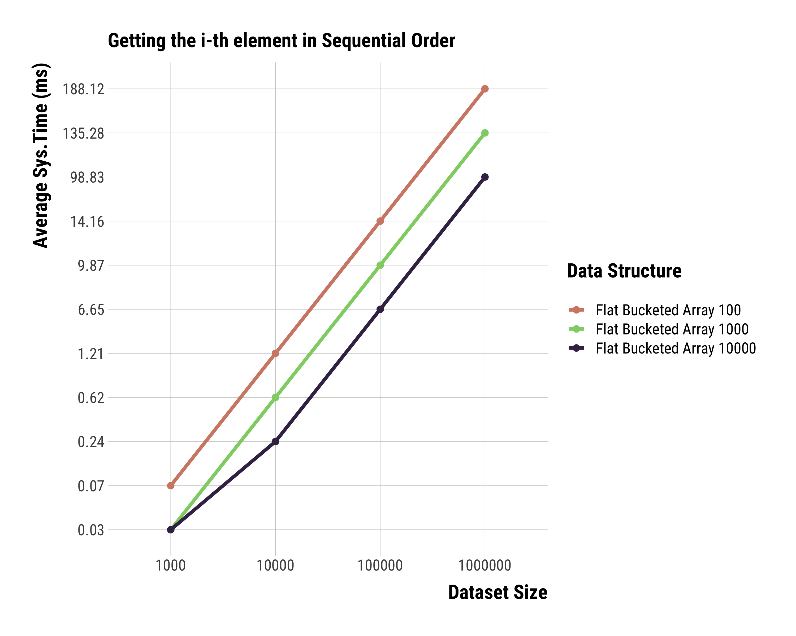

# N6idus 
[](https://github.com/brurucy/n6idus/actions/workflows/node.js.yml)


### TOC

  1. Intro
  2. Why should you use N6idus?
  3. The API 
  4. Benchmarks

### Intro

N6idus is an opinionated collection of **very** experimental data structures optimized for **extreme** performance with a very rich API.

At the moment we only have a **Flat Bucketed Array** that implements a **Indexed Ordered Set**.

Sometime in the future, we will also have(in this order):

   1. Indexed Ordered Map, planned to be released on 0.1.0
   2. Persistent Indexed Ordered Set, 0.2.0

### Why waste your time with N6idus's Indexed Ordered Set?

   1. Our Indexed Ordered Set is **very** fast`. It beats the crap out of **all other** JS set implementations.
   2. it is **the only** one that supports getting the i-th element in **logarithmic** time
   3. The API is quite rich. We cover all major ES6 goodies and offer many iterators and range updates.
   4. **100**% test coverage.

The key factor that allows these points to hold true is that it is not a Tree. If you ever used Python you 
might have come across [sorted containers](https://github.com/grantjenks/python-sortedcontainers), which was one of the
sources of inspiration for this library.

The main difference from this implementation to `sortedcontainers` is of a different balancing mechanism and
a much more effective indexing strategy, that uses a [Fenwick Array](https://en.wikipedia.org/wiki/Fenwick_tree).

Here are some complexities, with **B** being the **load factor/bucket size**:

| operation   | worst-case complexity  |
|-------------|----------------------- |
| push(n)     |         O(B)           |
| has(n)      |  O(log(n/B) * log(B))  |
| select(ith) |   O(log(n/B))          |
| delete(n)   |   O(B)                 |

### The API

Here's some points:

1. The main object is the **Indexed Ordered Set**, which is comprised of **SortedArraySet**s with fixed **load factor/bucket size** lengths.
2. A **SortedArraySet** is just a length-limited array with a **max** attribute. All operations ensure sortedness.
3. You can (and should) provide a **cmp** function. However, **WARNING**, the cmp function should be a **partial order**, that is, you have to be able to say that some **x** is **less than or equal to** some y. Here is the default cmp function: ```(x, y) => { return x <= y }```

Please, report any and **all** bugs you might come across.

#### Basic Operations:

##### Push
```javascript
import { IndexedOrderedSet } from "n6idus";
const ios = new IndexedOrderedSet();
ios.push(1);
console.log(ios);
// IndexedOrderedSet {
// buckets: [
//     SortedArraySet {
//         bucket: [Array],
//         max: 1,
//         cmp: [Function (anonymous)]
//     }
// ],
//     index: FenwickArray { innerStructure: [ 1 ] },
// length: 1,
//     cmp: [Function (anonymous)],
//     bucketSize: 1000
// }
```
##### Has
```javascript
import {IndexedOrderedSet} from "n6idus";
const ios = new IndexedOrderedSet()
ios.push(1);
console.log(ios.has(1));
// true
```
##### Select

Gets the i-th element.

```javascript
import {IndexedOrderedSet} from "n6idus";
const ios = new IndexedOrderedSet()
ios.push(1);
ios.push(2);
console.log(ios.select(0));
//1
```
##### Delete
```javascript
import {IndexedOrderedSet} from "n6idus";
const ios = new IndexedOrderedSet()
ios.push(1);
ios.push(2);
ios.delete(1);
console.log(ios);
// IndexedOrderedSet {
// buckets: [
//     SortedArraySet {
//         bucket: [Array],
//         max: 2,
//         cmp: [Function (anonymous)]
//     }
// ],
//     index: FenwickArray { innerStructure: [ 1 ] },
// length: 1,
//     cmp: [Function (anonymous)],
//     bucketSize: 1000
// }
```

##### Delete by Index
```javascript
import {IndexedOrderedSet} from "n6idus";
const ios = new IndexedOrderedSet()
ios.push(1);
ios.push(2);
ios.deleteByIndex(0);
console.log(ios);
// IndexedOrderedSet {
// buckets: [
//     SortedArraySet {
//         bucket: [Array],
//         max: 2,
//         cmp: [Function (anonymous)]
//     }
// ],
//     index: FenwickArray { innerStructure: [ 1 ] },
// length: 1,
//     cmp: [Function (anonymous)],
//     bucketSize: 1000
// }
```

#### ES6:

##### Filter

Filters over position and value

```javascript
import {IndexedOrderedSet} from "n6idus";
const ios = new IndexedOrderedSet()
ios.push(1);
ios.push(2);
ios.push(3);
ios.push(4);
ios.push(5);
const ios2 = ios.filter(([position, value]) => value % 2 === 0)
console.log(ios2.buckets)
// [
//  SortedArraySet {
//  bucket: [ 2, 4 ],
//      max: 4,
//      cmp: [Function (anonymous)]
//  }
// ]
```

##### Map

Maps over position and value

```javascript
import {IndexedOrderedSet} from "n6idus";
const ios = new IndexedOrderedSet()
ios.push(1);
ios.push(2);
ios.push(3);
ios.push(4);
ios.push(5);
const ios2 = ios.map(([position, value]) => value * 6);
console.log(ios2.buckets);
// [
//  SortedArraySet {
//  bucket: [ 6, 12, 18, 24, 30 ],
//       max: 30,
//       cmp: [Function (anonymous)]
// }
// ]
```

##### Reduce

Reduces over position and value

```javascript
import {IndexedOrderedSet} from "n6idus";
const ios = new IndexedOrderedSet();
ios.push(1);
ios.push(2);
ios.push(3);
ios.push(4);
ios.push(5);
const reducer = (acc, [position, value]) => {
    return acc + value.toString();
};
const product = ios.reduce(reducer, '');
console.log(product);
// 12345
```

##### ReduceRight

Reduces over position and value, starting from the end

```javascript
import {IndexedOrderedSet} from "n6idus";
const ios = new IndexedOrderedSet();
ios.push(1);
ios.push(2);
ios.push(3);
ios.push(4);
ios.push(5);
const reducer = (acc, [position, value]) => {
    return acc + value.toString();
};
const product = ios.reduceRight(reducer, '');
console.log(product);
// 54321
```

##### ForEach

Calls a function over each element of the set, does not return anything.

```javascript
import {IndexedOrderedSet} from "n6idus";
const ios = new IndexedOrderedSet();
ios.push(1);
ios.push(2);
ios.push(3);
ios.push(4);
ios.push(5);
ios.forEach(([position, value]) => {
    console.log(position, value);
});
// 0 1
// 1 2
// 2 3
// 3 4
// 4 5
```

#### Iterators:

##### MakeForwardCursor
```javascript
import {IndexedOrderedSet} from "n6idus";
const ios = new IndexedOrderedSet();
ios.push(1);
ios.push(2);
ios.push(3);
ios.push(4);
ios.push(5);
for (const [position, value] of ios.makeForwardCursor()) {
    console.log(position, value);
}
// 0 1
// 1 2
// 2 3
// 3 4
// 4 5
```

##### MakeBackwardsCursor
```javascript
import {IndexedOrderedSet} from "n6idus";
const ios = new IndexedOrderedSet();
ios.push(1);
ios.push(2);
ios.push(3);
ios.push(4);
ios.push(5);
for (const [position, value] of ios.makeBackwardsCursor()) {
    console.log(position, value);
}
// 4 5
// 3 4
// 2 3
// 1 2
// 0 1
```

##### MakeForwardCursorByIndex
```javascript
import {IndexedOrderedSet} from "n6idus";
const ios = new IndexedOrderedSet();
ios.push(1);
ios.push(2);
ios.push(3);
ios.push(4);
ios.push(5);
for (const [position, value] of ios.makeForwardCursorByIndex(1, 3)) {
    console.log(position, value);
}
// 1 2
// 2 3
// 3 4
```

##### MakeBackwardsCursorByIndex
```javascript
import {IndexedOrderedSet} from "n6idus";
const ios = new IndexedOrderedSet();
ios.push(1);
ios.push(2);
ios.push(3);
ios.push(4);
ios.push(5);
for (const [position, value] of ios.makeBackwardsCursorByIndex(3, 1)) {
    console.log(position, value);
}
// 3 4
// 2 3
// 1 2
```

##### MakeForwardCursorByValue
```javascript
import {IndexedOrderedSet} from "n6idus";
const ios = new IndexedOrderedSet();
ios.push(10);
ios.push(20);
ios.push(30);
ios.push(40);
ios.push(50);
for (const [position, value] of ios.makeForwardCursorByValue(20, 40)) {
    console.log(position, value);
}
// 1 20
// 2 30
// 3 40
```

##### MakeBackwardsCursorByValue
```javascript
import {IndexedOrderedSet} from "n6idus";
const ios = new IndexedOrderedSet();
ios.push(10);
ios.push(20);
ios.push(30);
ios.push(40);
ios.push(50);
for (const [position, value] of ios.makeBackwardsCursorByValue(40, 20)) {
    console.log(position, value);
}
// 3 40
// 2 30
// 1 20
```

#### Set Operations:

##### Union
```javascript
import { IndexedOrderedSet } from 'n6idus';
const ios = new IndexedOrderedSet();
ios.push(1);
ios.push(2);
ios.push(3);
ios.push(4);
ios.push(5);
const ios2 = new IndexedOrderedSet();
ios2.push(3);
ios2.push(4);
ios2.push(5);
ios2.push(6);
ios2.push(7);
const ios3 = ios.union(ios2);
console.log(ios3.buckets);
// [
//     SortedArraySet {
//     bucket: [
//         1, 2, 3, 4,
//         5, 6, 7
//     ],
//     max: 7,
//     cmp: [Function (anonymous)]
// }
// ]
```

##### Intersection
```javascript
import { IndexedOrderedSet } from 'n6idus';
const ios = new IndexedOrderedSet();
ios.push(1);
ios.push(2);
ios.push(3);
ios.push(4);
ios.push(5);
const ios2 = new IndexedOrderedSet();
ios2.push(3);
ios2.push(4);
ios2.push(5);
ios2.push(6);
ios2.push(7);
const ios3 = ios.union(ios2);
console.log(ios3.buckets);
// [
//     SortedArraySet {
//     bucket: [ 3, 4, 5 ],
//     max: 5,
//     cmp: [Function (anonymous)]
// }
// ]
```

##### Difference
```javascript
import { IndexedOrderedSet } from 'n6idus';
const ios = new IndexedOrderedSet();
ios.push(1);
ios.push(2);
ios.push(3);
ios.push(4);
ios.push(5);
const ios2 = new IndexedOrderedSet();
ios2.push(3);
ios2.push(4);
ios2.push(5);
ios2.push(6);
ios2.push(7);
const ios3 = ios.difference(ios2);
console.log(ios3.buckets);
// [
//     SortedArraySet {
//     bucket: [ 1, 2 ],
//     max: 2,
//     cmp: [Function (anonymous)]
// }
// ]
```

##### Symmetric Difference
```javascript
import { IndexedOrderedSet } from 'n6idus';
const ios = new IndexedOrderedSet();
ios.push(1);
ios.push(2);
ios.push(3);
ios.push(4);
ios.push(5);
const ios2 = new IndexedOrderedSet();
ios2.push(3);
ios2.push(4);
ios2.push(5);
ios2.push(6);
ios2.push(7);
const ios3 = ios.difference(ios2);
console.log(ios3.buckets);
// [
//     SortedArraySet {
//     bucket: [ 1, 2, 6, 7 ],
//     max: 7,
//     cmp: [Function (anonymous)]
// }
// ]
```

##### Same as

Two sets are equal **if** they contain exactly the same elements.

```javascript
import { IndexedOrderedSet } from 'n6idus';
const ios = new IndexedOrderedSet();
ios.push(1);
ios.push(2);
ios.push(3);
ios.push(4);
ios.push(5);
const ios2 = new IndexedOrderedSet();
ios2.push(1);
ios2.push(2);
ios2.push(3);
ios2.push(4);
ios2.push(5);
console.log(ios.sameAs(ios2));
```

##### Is Superset
```javascript
import { IndexedOrderedSet } from 'n6idus';
const ios = new IndexedOrderedSet();
ios.push(1);
ios.push(2);
ios.push(3);
ios.push(4);
ios.push(5);
const ios2 = new IndexedOrderedSet();
ios2.push(1);
ios2.push(2);
ios2.push(3);
ios2.push(4);
ios2.push(5);
console.log(ios.isSupersetOf(ios2));
ios.push(6);
console.log(ios.isSupersetOf(ios2));
ios.delete(1);
console.log(ios.isSupersetOf(ios2));
// true
// true
// false
```

##### Is Proper Superset
```javascript
import { IndexedOrderedSet } from 'n6idus';
const ios = new IndexedOrderedSet();
ios.push(1);
ios.push(2);
ios.push(3);
ios.push(4);
ios.push(5);
const ios2 = new IndexedOrderedSet();
ios2.push(1);
ios2.push(2);
ios2.push(3);
ios2.push(4);
ios2.push(5);
console.log(ios.isProperSupersetOf(ios2));
ios.push(6);
console.log(ios.isProperSupersetOf(ios2));
ios.delete(1);
console.log(ios.isProperSupersetOf(ios2));
// false
// true
// false
```

##### Is Subset
```javascript
import { IndexedOrderedSet } from 'n6idus';
const ios = new IndexedOrderedSet();
ios.push(1);
ios.push(2);
ios.push(3);
ios.push(4);
ios.push(5);
const ios2 = new IndexedOrderedSet();
ios2.push(1);
ios2.push(2);
ios2.push(3);
ios2.push(4);
ios2.push(5);
console.log(ios.isSubsetOf(ios2));
ios.push(6);
console.log(ios.isSubsetOf(ios2));
ios.delete(1);
ios.delete(6);
console.log(ios.isSubsetOf(ios2));
// true
// false
// true
```

##### Is Proper Subset
```javascript
import { IndexedOrderedSet } from 'n6idus';
const ios = new IndexedOrderedSet();
ios.push(1);
ios.push(2);
ios.push(3);
ios.push(4);
ios.push(5);
const ios2 = new IndexedOrderedSet();
ios2.push(1);
ios2.push(2);
ios2.push(3);
ios2.push(4);
ios2.push(5);
console.log(ios.isProperSubsetOf(ios2));
ios.push(6);
console.log(ios.isProperSubsetOf(ios2));
ios.delete(1);
ios.delete(6);
console.log(ios.isProperSubsetOf(ios2));
// false
// false
// true
```

##### Is Disjoint With
```javascript
import { IndexedOrderedSet } from 'n6idus';
const ios = new IndexedOrderedSet();
ios.push(1);
ios.push(2);
ios.push(3);
ios.push(4);
ios.push(5);
const ios2 = new IndexedOrderedSet();
ios2.push(6);
ios2.push(7);
console.log(ios.isDisjointWith(ios2));
ios.push(6);
console.log(ios.isDisjointWith(ios2));
// true
// false
```

##### Is Empty
```javascript
import { IndexedOrderedSet } from 'n6idus';
const ios = new IndexedOrderedSet();
console.log(ios.isEmpty());
ios.push(1);
ios.push(2);
console.log(ios.isEmpty());
ios.delete(1);
ios.delete(2);
console.log(ios.isEmpty());
// true
// false
// true
```

#### Heap operations: 

##### getMin
```javascript
import { IndexedOrderedSet } from 'n6idus';
const ios = new IndexedOrderedSet();
ios.push(1);
ios.push(2);
ios.push(3);
ios.push(4);
console.log(ios.getMin());
ios.deleteByIndex(0);
console.log(ios.getMin());
// 1
// 2
```

##### getMax
```javascript
import { IndexedOrderedSet } from 'n6idus';
const ios = new IndexedOrderedSet();
ios.push(1);
ios.push(2);
ios.push(3);
ios.push(4);
console.log(ios.getMax());
ios.deleteByIndex(ios.length - 1);
console.log(ios.getMax());
// 4
// 3
```

##### pop
```javascript
import { IndexedOrderedSet } from 'n6idus';
const ios = new IndexedOrderedSet();
ios.push(1);
ios.push(2);
ios.push(3);
ios.push(4);
console.log(ios.getMax());
ios.pop();
console.log(ios.getMax());
// 4
// 3
```

##### shift
```javascript
import { IndexedOrderedSet } from 'n6idus';
const ios = new IndexedOrderedSet();
ios.push(1);
ios.push(2);
ios.push(3);
ios.push(4);
console.log(ios.getMin());
ios.shift();
console.log(ios.getMin());
// 1
// 2
```

#### Range Operations:

##### Slice by Value
```javascript
import { IndexedOrderedSet } from 'n6idus';
const ios = new IndexedOrderedSet();
ios.push(1);
ios.push(2);
ios.push(3);
ios.push(4);
ios.push(5);
ios.push(6);
ios.push(7);
ios.push(8);
ios.push(9);
ios.push(10);
const ios2 = ios.sliceByValue(3, 7);
console.log(ios2.buckets);
console.log(ios.buckets);
// [
//     SortedArraySet {
//     bucket: [ 3, 4, 5, 6, 7 ],
//     max: 7,
//     cmp: [Function (anonymous)]
//     }
// ]
//     [
//     SortedArraySet {
//     bucket: [
//         1, 2, 3, 4,  5,
//         6, 7, 8, 9, 10
//     ],
//         max: 10,
//         cmp: [Function (anonymous)]
//     }
// ]
```

##### Splice by Value
```javascript
import { IndexedOrderedSet } from 'n6idus';
const ios = new IndexedOrderedSet();
ios.push(1);
ios.push(2);
ios.push(3);
ios.push(4);
ios.push(5);
ios.push(6);
ios.push(7);
ios.push(8);
ios.push(9);
ios.push(10);
ios.spliceByValue(2, 6);
console.log(ios.buckets);
// [
//     SortedArraySet {
//     bucket: [ 1, 7, 8, 9, 10 ],
//     max: 10,
//     cmp: [Function (anonymous)]
//     }
// ]
```

##### Slice by Index
```javascript
import { IndexedOrderedSet } from 'n6idus';
const ios = new IndexedOrderedSet();
ios.push(1);
ios.push(2);
ios.push(3);
ios.push(4);
ios.push(5);
ios.push(6);
ios.push(7);
ios.push(8);
ios.push(9);
ios.push(10);
const ios2 = ios.sliceByIndex(2, 6);
console.log(ios2.buckets);
console.log(ios.buckets);
// [
//     SortedArraySet {
//     bucket: [ 3, 4, 5, 6, 7 ],
//         max: 7,
//         cmp: [Function (anonymous)]
//     }
// ]
// [
//     SortedArraySet {
//     bucket: [
//         1, 2, 3, 4,  5,
//         6, 7, 8, 9, 10
//     ],
//     max: 10,
//     cmp: [Function (anonymous)]
//     }
// ]
```

##### Splice by Index
```javascript
import { IndexedOrderedSet } from 'n6idus';
const ios = new IndexedOrderedSet();
ios.push(1);
ios.push(2);
ios.push(3);
ios.push(4);
ios.push(5);
ios.push(6);
ios.push(7);
ios.push(8);
ios.push(9);
ios.push(10);
ios.spliceByIndex(1, 5);
console.log(ios.buckets);
//
// [
//     SortedArraySet {
//     bucket: [ 1, 7, 8, 9, 10 ],
//         max: 10,
//         cmp: [Function (anonymous)]
//     }
// ]
```

#### To Array Conversions

##### To Array
```javascript
import {IndexedOrderedSet} from "n6idus";
const ios = new IndexedOrderedSet();
ios.push(10);
ios.push(2);
ios.push(8);
ios.push(3);
ios.push(12);
console.log(ios.toArray());
// [ 2, 3, 8, 10, 12 ]
```

##### Filter to Array
```javascript
import {IndexedOrderedSet} from "n6idus";
const ios = new IndexedOrderedSet()
ios.push(1);
ios.push(2);
ios.push(3);
ios.push(4);
ios.push(5);
const ios2 = ios.filterToArray(([position, value]) => value % 2 === 0);
console.log(ios2);
// [ 2, 4 ]
```

##### Map to Array
```javascript
import {IndexedOrderedSet} from "n6idus";
const ios = new IndexedOrderedSet()
ios.push(1);
ios.push(2);
ios.push(3);
ios.push(4);
ios.push(5);
const ios2 = ios.mapToArray(([position, value]) => value * 6);
console.log(ios2);
// [ 6, 12, 18, 24, 30 ]
```

#### Misc. Logical

##### Every
```javascript
import { IndexedOrderedSet } from 'n6idus';
const ios = new IndexedOrderedSet();
ios.push(1);
ios.push(2);
ios.push(3);
ios.push(4);
ios.push(5);
console.log(ios.every(([position, value]) => value % 2 === 0));
// false
```

##### Some
```javascript
import { IndexedOrderedSet } from 'n6idus';
const ios = new IndexedOrderedSet();
ios.push(1);
ios.push(2);
ios.push(3);
ios.push(4);
ios.push(5);
console.log(ios.some(([position, value]) => value % 2 === 0));
// true
```

#### Misc. Basic

##### Next Higher Key
```javascript
import { IndexedOrderedSet } from 'n6idus';
const ios = new IndexedOrderedSet();
ios.push(1);
ios.push(2);
ios.push(3);
ios.push(4);
ios.push(5);
console.log(ios.nextHigherKey(3));
console.log(ios.nextHigherKey(5));
// 4
// null
```

##### Next Lower Key
```javascript
import { IndexedOrderedSet } from 'n6idus';
const ios = new IndexedOrderedSet();
ios.push(1);
ios.push(2);
ios.push(3);
ios.push(4);
ios.push(5);
console.log(ios.nextLowerKey(3));
console.log(ios.nextLowerKey(1));
// 2
// null
```

### Benchmarks

#### Indexed Ordered Set

We've benchmarked the Flat Bucketed Array, with differing **Load Factor** values against the **most popular** collections for sorted sets:

1. [Splay Tree from CollectionsJS](https://www.collectionsjs.com/sorted-set)
2. [The Fastest BTree](https://www.npmjs.com/package/sorted-btree)
3. [Non-persistent Red-Black Tree](https://www.npmjs.com/package/bintrees)
4. [Persistent Red-Black Tree](https://www.npmjs.com/package/functional-red-black-tree)

The test machine was an M1 MBA, and there were more than ten thousand runs averaged out for the following plots.

Adding, searching and deleting were tested, with different insertion approaches: sequentially, that is, monotonically, unrealistically, and random.

##### Adding in Sequential Order


##### Searching in Sequential Order


##### Getting the i-th element in Sequential Order



##### Deleting in Sequential Order


##### Adding in Random Order


##### Getting the i-th element in Random Order


##### Selecting the i-th element


##### Deleting in Random Order


