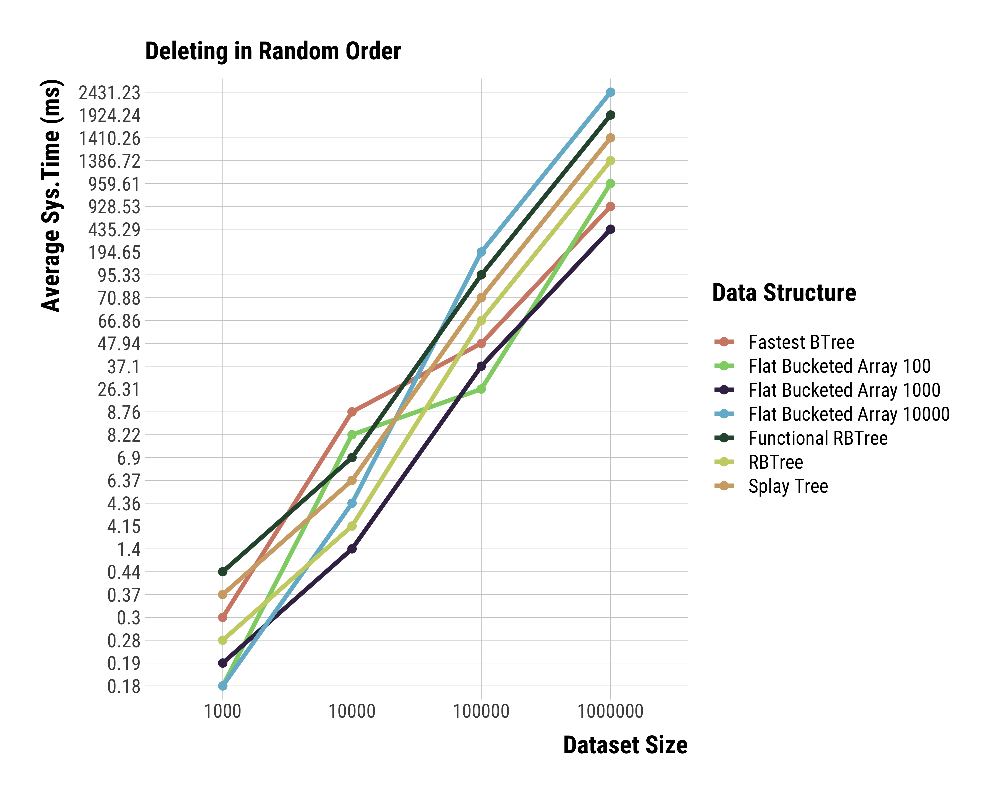

# N6idus 

### TOC

  1. Intro
  2. Why should you use N6idus?
  3. Benchmarks
     * Adding in sequential order
     * Searching in sequential order
     * Getting the i-th element in sequential order
     * Deleting in sequential order
     * Adding in random order
     * Searching in random order
     * Getting the i-th element in random order
     * Deleting in random order

### Intro

N6idus is an opinionated collection of experimental data structures optimized for performance.

At the moment we provide a single data structure, an **Indexed Sorted Array Set**.

Here are the use cases:

1. Virtually any purpose that you would use a search tree for AND
2. You need to fetch the i-th element in logarithmic time AND
3. You want to use set operations

### Why should you use N6idus?

Our **Indexed Sorted Set** is fast. Really, **Really** fast.

In fact, just go to the benchmarks session and see. It's around twice as fast as the currently fastest search tree.

The perplexingly simple data structure behind it, the **Flat Bucketed Array**, is nothing but an array of arrays of fixed size
with a clever [Fenwick Array](https://en.wikipedia.org/wiki/Fenwick_tree) as an index, that uses a **special** algorithm 
to bisect it in **O(log(n))** instead of **O(log^2(n))**time.

It is quite similar to [sortedcontainers](https://github.com/grantjenks/python-sortedcontainers), with the main difference
being in the indexing and balancing strategy.

**Also, we have 100% test coverage.**

Here are the worst-case complexities, with **B** being the **load factor/bucket size**:

| operation   |     worst-case complexity  |
|-------------|--------------------------- |
| push(n)     |         O(B)               |
| has(n)      |  O(log(n/B) * log(B))      |
| select(ith) |   O(log(n/B))              |
| delete(n)   |   O(B)                     |

### Benchmarks

#### **Indexed Sorted Array Set**

We've benchmarked the **Flat Bucketed Array**, with differing **Load Factor** values against the **most popular** collections for sorted sets:

1. [Splay Tree from CollectionsJS](https://www.collectionsjs.com/sorted-set)
2. [The (supposedly)Fastest BTree](https://www.npmjs.com/package/sorted-btree)
3. [Non-persistent Red-Black Tree](https://www.npmjs.com/package/bintrees)
4. [Persistent Red-Black Tree](https://www.npmjs.com/package/functional-red-black-tree)

The test machine was an M1 MBA, and there were more than ten thousand runs averaged out for the following plots.

Adding, searching and deleting were tested, with different insertion approaches: sequentially, that is
monotonically and unrealistically, and at random(realistically).

The **Flat Bucketed Array** is, at least, around **twice** as fast as all others in every single benchmark but the sequential
deletion one, due to how balancing is done, however, the **spliceByValue** and **spliceByIndex** functions offset that.

It's not likely that you would ever have to actually change a load factor different than the default, however, if you do
I hope that these benchmarks will serve as a reference for tuning that parameter.

##### Adding in Sequential Order

##### Searching in Sequential Order

##### Getting the i-th element in Sequential Order

##### Deleting in Sequential Order

##### Adding in Random Order

##### Searching in Random Order

##### Getting the i-th element in Random Order

##### Deleting in Random Order

### License

Please **cite** this github repo as a source if you use this in a research paper.

Copyright 2021 B. Rucy. C. A. De Lima

Redistribution and use in source and binary forms, with or without modification, are permitted provided that the following conditions are met:

1. Redistributions of source code must retain the above copyright notice, this list of conditions and the following disclaimer.

2. Redistributions in binary form must reproduce the above copyright notice, this list of conditions and the following disclaimer in the documentation and/or other materials provided with the distribution.

3. Neither the name of the copyright holder nor the names of its contributors may be used to endorse or promote products derived from this software without specific prior written permission.

THIS SOFTWARE IS PROVIDED BY THE COPYRIGHT HOLDERS AND CONTRIBUTORS "AS IS" AND ANY EXPRESS OR IMPLIED WARRANTIES, INCLUDING, BUT NOT LIMITED TO, THE IMPLIED WARRANTIES OF MERCHANTABILITY AND FITNESS FOR A PARTICULAR PURPOSE ARE DISCLAIMED. IN NO EVENT SHALL THE COPYRIGHT HOLDER OR CONTRIBUTORS BE LIABLE FOR ANY DIRECT, INDIRECT, INCIDENTAL, SPECIAL, EXEMPLARY, OR CONSEQUENTIAL DAMAGES (INCLUDING, BUT NOT LIMITED TO, PROCUREMENT OF SUBSTITUTE GOODS OR SERVICES; LOSS OF USE, DATA, OR PROFITS; OR BUSINESS INTERRUPTION) HOWEVER CAUSED AND ON ANY THEORY OF LIABILITY, WHETHER IN CONTRACT, STRICT LIABILITY, OR TORT (INCLUDING NEGLIGENCE OR OTHERWISE) ARISING IN ANY WAY OUT OF THE USE OF THIS SOFTWARE, EVEN IF ADVISED OF THE POSSIBILITY OF SUCH DAMAGE.
